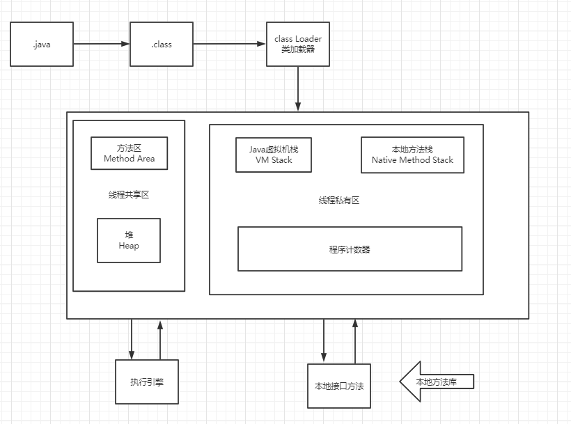
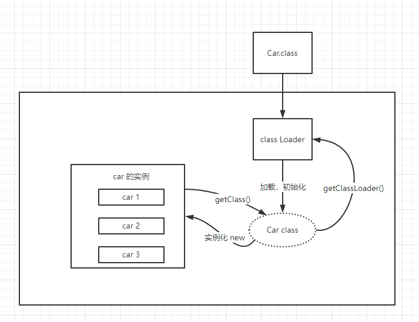

 

# JVM探究

- 请你谈谈你对JVM的理解?java8虚拟机和之前的变化更新? 
- 什么是OOM，什么是栈溢出StackOverFlowError?怎么分析?
- JVM的常用调优参数有哪些?
- 内存快照如何抓取，怎么分析Dump文件?知道吗?
- 谈谈JVM中，类加载器你的认识?


## 1、JVM的位置


## 2、JVM的体系结构



运行时数据区可分为两部分：**线程私有区和线程共享区**。

线程私有区主要包含三个区域：**虚拟机栈**，**本地方法栈**，**程序计数器**。

线程共享区主要包含：堆区，方法区。


### 1、程序计数器

程序计数器是一块较小的内存空间，它可以看做是当前线程所执行的字节码的行号指示器

在虚拟机的概念模型里，字节码解释器工作时就是通过程序计数器的值来选定下一条需要执行的字节码指令

由于java虚拟机的多线程是通过线程轮流切换并分配处理器执行时间的方式来实现的，在任一时刻，一个处理器（一个内核）都只会执行一条线程中的指令。所以为了线程切换后能够恢复到正确的执行位置，每条线程都需要有一个独立的程序计数器。所以归为“线程私有”


### 2、Java虚拟机栈

Java虚拟机栈也是线程私有的，他的生命周期和线程相同。

虚拟机栈描述的是Java方法执行的内存模型：每个方法在执行的同时都会创建一个栈帧用于存储局部变量表，操作数栈，动态链接，方法出口等信息

每一个方法从调用直到执行完成的过程，就对应着一个栈帧在虚拟机栈中入栈到出栈的过程

对于程序猿来说，最看重的还是堆内存和栈内存，其中的栈内存就是虚拟机栈，或者说是虚拟机栈中局部变量表部分

局部变量表中存放课编译期可知的各种基本数据类型，对象引用和returnAddress（指向了一条字节码指令的地址）

局部变量表的单位为Slot，其中64位长度的long，double占用2个Slot，其余的占一个，局部变量表的内存空间是编译期间完成分配的


### 3、本地方法栈

本地方法栈使用Native方法


### 4、java堆

java堆是被所有线程共享的一块内存区域，在虚拟机启动时创建

此内存区域的唯一目的就是存放对象实例，几乎所有的对象实例都在这里分配内存


## 3、类加载器



## 4、双亲委派机制

1. JVM预定义的三种类型类加载器：

   - **启动（Bootstrap）类加载器**：是用本地代码实现的类装入器，它负责将 `<Java_Runtime_Home>/lib`下面的类库加载到内存中（比如`rt.jar`）。由于引导类加载器涉及到虚拟机本地实现细节，开发者无法直接获取到启动类加载器的引用，所以不允许直接通过引用进行操作。
   - **标准扩展（Extension）类加载器**：是由 Sun 的 `ExtClassLoader（sun.misc.Launcher$ExtClassLoader）`实现的。它负责将`< Java_Runtime_Home >/lib/ext`或者由系统变量 `java.ext.dir`指定位置中的类库加载到内存中。开发者可以直接使用标准扩展类加载器。
   - **系统（System）类加载器**：是由 Sun 的 `AppClassLoader（sun.misc.Launcher$AppClassLoader）`实现的。它负责将系统类路径（`CLASSPATH`）中指定的类库加载到内存中。开发者可以直接使用系统类加载器。

   除了以上列举的三种类加载器，还有一种比较特殊的类型 — 线程上下文类加载器。

2. 双亲委派机制描述
   某个特定的类加载器在接到加载类的请求时，首先将加载任务委托给父类加载器，**依次递归**，如果父类加载器可以完成类加载任务，就成功返回；只有父类加载器无法完成此加载任务时，才自己去加载。

3. 步骤

   - 类加载器收到类加载的请求!

   - 将这个请求向上委托给父类加载器去完成，一直向上委托，知道启动类加载器

   - 启动加载器检查是否能够加载当前这个类 能加载就结束，使用当前的加载器，否则，抛出异常，通知子加载器进行加载

   - 重复步骤3

   - Class Not Found ~

   - Java虚拟机的第一个类加载器是Bootstrap，这个加载器很特殊，**它不是Java类，因此它不需要被别人加载，它嵌套在Java虚拟机内核里面，也就是JVM启动的时候Bootstrap就已经启动，它是用C++写的二进制代码（不是字节码）**，它可以去加载别的类。

     这也是我们在测试时为什么发现`System.class.getClassLoader()`结果为null的原因，这并不表示System这个类没有类加载器，而是它的加载器比较特殊，是`BootstrapClassLoader`，由于它不是Java类，因此获得它的引用肯定返回null。

## 5、沙箱安全机制

## 6、Native

- 凡带了`Native`关键字的，说明java的作用范围达不到了，回去调用底层C语言的库!
- native : 凡是带了native会进入本地方法栈
- 调用本地方法本地接口JNI
- JNI作用:扩展Java的使用，融合不同的编程语言为Java所用! 最初:C、C++。
- Java诞生的时候C、C++横行，想要立足，必须要有调用C、C++的程序~
- 它在内存区域中专门开辟了一块标记区域:Native Method Stack，登记 native 方法在最终执行的时候，加载本地方法库中的方法通过JNI
- JNI: Java Native Interface (Java本地方法接口)
- Java程序驱动打印机，管理系统，掌握即可，在企业级应用中较为少见!

## 7、PC寄存器

## 8、方法区(Method Area )

- 方法区是被所有线程共享，所有字段和方法字节码，以及一些特殊方法，如构造函数，接口代码也在此定义简单说，所有定义的方法的信息都保存在该区域，此区域属于共享区间:

- 静态变量、常量、类信息(构造方法、接口定义)、运行时的常量池存在方法区中，但是实例变量存在堆内存中，和方法区无关
   static ，final，Class，常量池

## 9、栈

- 栈: 栈内存，主管程序的运行，生命周期和线程同步;
- 线程结束，栈内存也就是释放，对于栈来说 不存在垃圾回收问题
- 一旦线程结束，栈就Over!
- 栈:8大基本类型+对象引用+实例的方法
- 栈运行原理: 栈帧

## 10、三种JVM

## 11、堆(Heap)

-  一个JVM只有一个堆内存，堆内存的大小是可以调节的。

- 类加载器读取了类文件后，一般会把什么东西放到堆中? 类，方法，常量，变量~，保存我们所有引用类型的真实对象;

- 堆内存中还要细分为三个区域:

  - 新生区(伊甸园区)

  - 养老区

  - 永久区

    

```java
public class Demo02{
    public static void main(String[] args){
        //返回虚拟机试图使用的最大内存
        long max = Runtimegetuntime()maxMemory(); //字节 1024 * 1024
        //返回jvm的初始化总内存
        long total = Runtime.getRuntime().totalMemory();
        System.out.println("max="+max+"字节\t"+(max/(double)1024/1024)+"MB”);	
		System.out.println("total="+tota1+"字节\t"+(tota1/(double)1024/1024)+"MB")
        //默认情况下: 分配的总内存 是电脑内存的 1/4，而初始化的内存: 1/64
        //00M解决方法:
			//1试扩大堆内存看结果
			//2.分析内存，看一下那个地方出现了问题(专业工具)

		//-Xms1024m-Xmx1024m-xx:+PrintGCDetails
    }
}
```


## 12、新生区、老年区

GC垃圾回收，主要是在伊甸园区和养老区

Exception in thread "main" java.lang.0utOfMemoryError:Java heap  space  ——>堆内存满了


在一个项目中，突然出现了OOM故障，那么该如何排除~研究为什么出错

- 能够看到代码第几行出错:内存快照分析工具，MAT，Jprofiler 

- Dubug，一行行分析代码!

  

**MAT，Jprofiler 作用**

- 分析Dump内存文件，快速定位内存泄露获得堆中的数据
- 获得大的对象

## 13、永久区

- 逻辑上存在，物理上不存在
- 这个区域常驻内存的。用来存放JDK自身携带的Class对象。Interface元数据，存储的是Java运行时的一些环境或类信息~，
- 这个区域不存在垃圾回收!关闭VM虚拟就会释放这个区域的内存
- 一个启动类，加载了大量的第三方jar包。Tomcat部署了太多的应用，大量动态生成的反射类。不断的被加载。直到内存满，就会出现OOM;
-  jdk1.6之前: 永久代，常量池是在方法区;
-  jdk1.7 永久代，但是慢慢的退化了， 去永久代，常量池在堆中
-  jdk1.8之后:无永久代，常量池在元空间

## 14、堆内存调优

```
  -Xms 设置初始化内存分配大小/164
  -Xmx 设置最大分虎内存，默认 1/4
  -xx:+PrintGCDetails/打印GC垃圾回收信息
  -XX:+HeapDumpOnOutOfMemoryError //OOm DUMP
  -Xms1m -Xmx8m -XX:+HeapDumpOnOutOfMemoryError
```


## 15、GC:垃圾回收机制

- GC两种类:轻GC(普通的GC) 重GC(全局GC)

- GC题目:

  - JVM的内存模型和分区~详细到每个区放什么?

    

  - 堆里面的分区有哪些?Eden，from，to，老年区，说说他们的特点!

    - 每次GC都会将Eden区活的对象移入到幸存区中，一旦Eden区被GC后，就会是空的
    - 幸存区谁空谁是`to`
    - 当一个对象经历了15（默认）次GC之后还没死，就会进入老年区

  - GC的算法有哪些?标记清除法，标记压缩，复制算法，引用计数器，怎么用的?轻GC和重GC分别在什么时候发生?

    - 引用计数器（不管）

    - 标记清除法（压缩）

      

    - 复制算法：在两个幸存区复制来复制去

      

    - 内存效率:复制算法>标记清除算法>标记压缩算法(时间复杂度)

    - 内存整齐度:复制算法=标记压缩算法>标记清除算法

    - 内存利用率:标记压缩算法=标记清除算法>复制算法

    - 年轻代:

      - 存活率低
      - 复制算法!

    - 老年代:

    - 区域大:存活率

    - 标记清除乐标记压缩混合实现 
