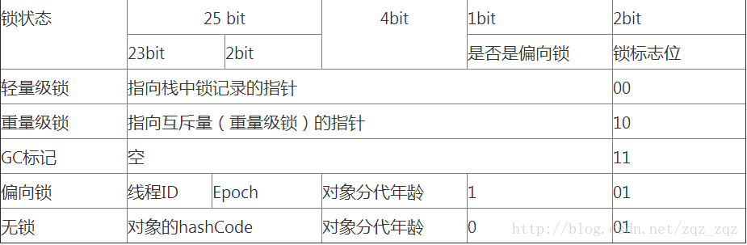
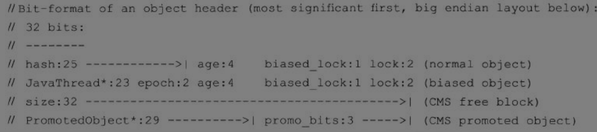

 

# JVM探究

- 请你谈谈你对JVM的理解?java8虚拟机和之前的变化更新? 
- 什么是OOM，什么是栈溢出StackOverFlowError?怎么分析?
- JVM的常用调优参数有哪些?
- 内存快照如何抓取，怎么分析Dump文件?知道吗?
- 谈谈JVM中，类加载器你的认识?


## 1、JVM的位置


## 2、JVM的体系结构


运行时数据区可分为两部分：**线程私有区和线程共享区**。

线程私有区主要包含三个区域：**虚拟机栈**，**本地方法栈**，**程序计数器**。

线程共享区主要包含：堆区，方法区。


### 1、程序计数器

程序计数器是一块较小的内存空间，它可以看做是当前线程所执行的字节码的行号指示器

在虚拟机的概念模型里，字节码解释器工作时就是通过程序计数器的值来选定下一条需要执行的字节码指令

由于java虚拟机的多线程是通过线程轮流切换并分配处理器执行时间的方式来实现的，在任一时刻，一个处理器（一个内核）都只会执行一条线程中的指令。所以为了线程切换后能够恢复到正确的执行位置，每条线程都需要有一个独立的程序计数器。所以归为“线程私有”


### 2、Java虚拟机栈

Java虚拟机栈也是线程私有的，他的生命周期和线程相同。

虚拟机栈描述的是Java方法执行的内存模型：每个方法在执行的同时都会创建一个栈帧用于存储局部变量表，操作数栈，动态链接，方法出口等信息

每一个方法从调用直到执行完成的过程，就对应着一个栈帧在虚拟机栈中入栈到出栈的过程

对于程序猿来说，最看重的还是堆内存和栈内存，其中的栈内存就是虚拟机栈，或者说是虚拟机栈中局部变量表部分

局部变量表中存放课编译期可知的各种基本数据类型，对象引用和returnAddress（指向了一条字节码指令的地址）

局部变量表的单位为Slot，其中64位长度的long，double占用2个Slot，其余的占一个，局部变量表的内存空间是编译期间完成分配的


### 3、本地方法栈

本地方法栈使用Native方法

凡带了`Native`关键字的，说明java的作用范围达不到了，回去调用底层C语言的库!

它在内存区域中专门开辟了一块标记区域:Native Method Stack，登记 native 方法在最终执行的时候，加载本地方法库中的方法通过JNI

调用本地方法本地接口JNI  （Java Native Interface ，Java本地方法接口)，JNI作用:扩展Java的使用，融合不同的编程语言为Java所用! 最初:C、C++。


### 4、java堆

java堆是被所有线程共享的一块内存区域，在虚拟机启动时创建

此内存区域的唯一目的就是存放对象实例，几乎所有的对象实例都在这里分配内存 

在《java虚拟机规范》中的描述是：所有的对象实例以及数组都要在堆上分配，但是随着技术的的发展，所有的对象都分配在堆上也渐渐变得不是那么绝对了。

Java堆是垃圾收集器管理的主要区域。

从内存回收的角度上看，由于现在收集器基本都采用分代手机算法，所以Java堆中还可以细分为：新生代和老年代；再细致一点的有Eden空间，From Survivor空间，To Survivor空间等

从内存分配的角度上看，线程共享的Java堆中可能划分多个线程私有的分配缓冲区

当前主流的虚拟机都是按照可扩展来实现的（-Xmx，-Xms）


### 5、方法区

方法区和Java堆一样，是各个线程共享的内存区域，用于存储已被虚拟机加载的类信息，常量，静态变量等数据，所有定义的方法的信息都保存在该区域

这里要区分永久代和方法区两个概念，仅仅是用实现永久代的方式实现方法区而已，这样做是为了HotSpot的垃圾收集器能像管理Java堆一样管理这部分的内存，能够省去专门为方法区编写内存管理代码的工作，这属于实现细节。

不过HotSpot虚拟机现在也有放弃永久代并逐步改为采用Native Memory来实现方法区的规划了

在JDK6的时候就有这个计划了，到了JDK7已经把原本放在永久代的常量池，静态变量移出，带了JDK8，终于完全废弃了永久代这个概念，在本地内存中实现了元空间来代替。


#### 5.1、运行时常量池

运行时常量池是方法区的一部分，主要用于存储Class文件中的常量池 -> 存放的编译期生成的各种字面量和符号引用

运行时常量池相对于Class文件常量池的一个重要特征是具备动态性

Java语言不要求常量一定只有编译期才会产生，也就是并非预置入Class文件中常量池的内容才能进入方法区运行时常量池，运行期间也可能将新的常量放入池中 -> String类的intern()方法。


### 6、直接内存

直接内存不是虚拟机运行时数据区的一部分，但是这部分内存也被频繁地使用，而且也可能导致OOM，所以放在这里一起讲

在JDK1.4引入了I/O流，它可以使用Native函数直接分配堆外内存，然后通过一个存储在Java堆中的DirectByteBuffer对象作为这块内存的引用进行操作，这就避免了Java堆和Native堆中来回复制数据。


## 3、HotSpot虚拟机对象

### 1、对象的 创建

> 类加载

当虚拟机获取到一条new指令时，首先将去检查这个指令的参数是否能在常量池中定位到一个类的符号引用，并检查这个符号应用代表的类是否已被加载，解析和初始化过。如果没有，那必须执行相应的类加载过程。

> 分配内存

在加载检查通过后，开始分配内存，对象所需内存的带下在类加载完成购便可完全确定，为对象分配空间的任务相同于把一块确定大小的内存从java堆中划分出来

这里有两种方式：

- 指针碰撞

  指针碰撞是针对于内存是绝对规整的，这时候只需要把指针进行移动

- 空闲列表

  空闲列表就是针对内存不是规整的，已使用的内存和空间的内存相互交错，这时候虚拟机必须维护一个列表，记录上哪些内存是可用的，在分配的时候从列表中找到一块可用的内存分配给对象实例，并更新列表上的记录。

另一个需要考虑的问题是对象创建在虚拟机中是非常频繁的行为，即使是仅仅修改一个指针所指向的位置，在并发情况下也不是线程安全的。

解决这个问题有两种方案：

- 对分配内存空间的动作进行同步处理

  实际上虚拟机采用CAS配上失败重试的方式保证更新操作的原子性

- 把内存分配的动作按照线程划分在不同的空间之中进行

  每个线程在Java堆中预先分配一小块内存，成为本地线程分配缓冲（TLAB） 。那个线程需要分配内存，就在那个线程的TLAB上分配。只有TLAB用完并分配新的TLAB时，才需要同步锁定。

  使用TLAB，可以通过-XX:+/-UseTLAB参数来设定。

> 设置零值

内存分配完之后，虚拟机需要将分配到的内存空间都初始化为零值（不包括对象头）

这一步保证了对象的实例字段在Java代码中可以不赋值就直接使用，程序能访问到这些字段的数据类型所对应的零值


>设置信息

接下来，虚拟机要对对象进行必要的设置，包括是哪个类的实例，如何才能找到类的元数据信息，对象的哈希码，对象的GC分代年龄等信息。

这些信息存放在对象的对象头之中。根据虚拟机当前的运行状态不同，如是否启用偏向锁等。


> init

在上面的工作都完成之后，从虚拟机的视图来看，一个新的对象已经产生了，接下来就是按照程序员的意向进行初始化赋值，这样一个真正可用的对象才算完全产生出来。


### 2、对象的内存布局

对象在内存中存储的布局可以分为3块区域：对象头（Header）、实例数据（Instance Data）和对齐填充

> 对象头

对象头包括两部分信息：

- 第一部分官方称为“Mark Word”

  用于存储对象自身的运行时数据，如哈希码（HashCode）、GC分代年龄、锁状态标志、线程持有的锁、偏向线程ID、偏向时间戳等。

  对象头存储的信息是与对象自身定义的数据无关的额外存储成本

  markword数据的长度在32位和64位的虚拟机（未开启压缩指针）中分别为32bit和64bit，它的**最后2bit是锁状态标志位**，用来标记当前对象的状态，对象的所处的状态，决定了markword存储的内容，如下表所示:

  | 状态             | 标志位 | 存储内容                             |
  | ---------------- | ------ | ------------------------------------ |
  | 未锁定           | 01     | 对象哈希码、对象分代年龄             |
  | 轻量级锁定       | 00     | 指向锁记录的指针                     |
  | 膨胀(重量级锁定) | 10     | 执行重量级锁定的指针                 |
  | GC标记           | 11     | 空(不需要记录信息)                   |
  | 可偏向           | 01     | 偏向线程ID、偏向时间戳、对象分代年龄 |

  

  

- 第二部分是类型指针，即对象指向他的类元数据指针

  虚拟机通过这个指针来确定这个对象是哪个类的实例。

另外，如果对象是一个数组，在对象头中还必须有一块用于记录数组长度的数据，因为虚拟机可以通过普通的Java对象的元数据信息确定Java对象的大小，但是从数据的元数据中却无法确定数数组的大小。


> 实例数据

这部分树对象真正存储的有效数据，也是在程序代码中所定义的各种类型的字段内容，包括父类和子类

这部分的存储顺序会受到虚拟机分配策略参数和字段在Java源码中定义的顺序的影响


> 对齐填充

这部分并不是必然存在的，也没有特别的含义，它仅仅起着占位符的作用。


### 3、对象的访问定位

建立对象是为了使用对象，我们的Java程序需要通过栈上的referece数据来操作堆上的具体对象。

目前主流的访问方式有使用句柄和直接指针两种

- 如果使用句柄访问的话，那么Java堆中将会划出一块内存来作为句柄池，reference中存储的就是对象的句柄地址，而句柄中包含了对象实例数据与类型数据各自的具体地址信息。


## 3、类加载器


## 4、双亲委派机制

1. JVM预定义的三种类型类加载器：

   - **启动（Bootstrap）类加载器**：是用本地代码实现的类装入器，它负责将 `<Java_Runtime_Home>/lib`下面的类库加载到内存中（比如`rt.jar`）。由于引导类加载器涉及到虚拟机本地实现细节，开发者无法直接获取到启动类加载器的引用，所以不允许直接通过引用进行操作。
   - **标准扩展（Extension）类加载器**：是由 Sun 的 `ExtClassLoader（sun.misc.Launcher$ExtClassLoader）`实现的。它负责将`< Java_Runtime_Home >/lib/ext`或者由系统变量 `java.ext.dir`指定位置中的类库加载到内存中。开发者可以直接使用标准扩展类加载器。
   - **系统（System）类加载器**：是由 Sun 的 `AppClassLoader（sun.misc.Launcher$AppClassLoader）`实现的。它负责将系统类路径（`CLASSPATH`）中指定的类库加载到内存中。开发者可以直接使用系统类加载器。

   除了以上列举的三种类加载器，还有一种比较特殊的类型 — 线程上下文类加载器。

2. 双亲委派机制描述
   某个特定的类加载器在接到加载类的请求时，首先将加载任务委托给父类加载器，**依次递归**，如果父类加载器可以完成类加载任务，就成功返回；只有父类加载器无法完成此加载任务时，才自己去加载。

3. 步骤

   - 类加载器收到类加载的请求!

   - 将这个请求向上委托给父类加载器去完成，一直向上委托，知道启动类加载器

   - 启动加载器检查是否能够加载当前这个类 能加载就结束，使用当前的加载器，否则，抛出异常，通知子加载器进行加载

   - 重复步骤3

   - Class Not Found ~

   - Java虚拟机的第一个类加载器是Bootstrap，这个加载器很特殊，**它不是Java类，因此它不需要被别人加载，它嵌套在Java虚拟机内核里面，也就是JVM启动的时候Bootstrap就已经启动，它是用C++写的二进制代码（不是字节码）**，它可以去加载别的类。

     这也是我们在测试时为什么发现`System.class.getClassLoader()`结果为null的原因，这并不表示System这个类没有类加载器，而是它的加载器比较特殊，是`BootstrapClassLoader`，由于它不是Java类，因此获得它的引用肯定返回null。

## 5、沙箱安全机制


## 6、PC寄存器


## 11、堆(Heap)

-  一个JVM只有一个堆内存，堆内存的大小是可以调节的。

- 类加载器读取了类文件后，一般会把什么东西放到堆中? 类，方法，常量，变量~，保存我们所有引用类型的真实对象;

- 堆内存中还要细分为三个区域:

  - 新生区(伊甸园区)

  - 养老区

  - 永久区

    

```java
public class Demo02{
    public static void main(String[] args){
        //返回虚拟机试图使用的最大内存
        long max = Runtimegetuntime()maxMemory(); //字节 1024 * 1024
        //返回jvm的初始化总内存
        long total = Runtime.getRuntime().totalMemory();
        System.out.println("max="+max+"字节\t"+(max/(double)1024/1024)+"MB”);	
		System.out.println("total="+tota1+"字节\t"+(tota1/(double)1024/1024)+"MB")
        //默认情况下: 分配的总内存 是电脑内存的 1/4，而初始化的内存: 1/64
        //00M解决方法:
			//1试扩大堆内存看结果
			//2.分析内存，看一下那个地方出现了问题(专业工具)

		//-Xms1024m-Xmx1024m-xx:+PrintGCDetails
    }
}
```


## 12、新生区、老年区

GC垃圾回收，主要是在伊甸园区和养老区

Exception in thread "main" java.lang.0utOfMemoryError:Java heap  space  ——>堆内存满了


在一个项目中，突然出现了OOM故障，那么该如何排除~研究为什么出错

- 能够看到代码第几行出错:内存快照分析工具，MAT，Jprofiler 

- Dubug，一行行分析代码!

  

**MAT，Jprofiler 作用**

- 分析Dump内存文件，快速定位内存泄露获得堆中的数据
- 获得大的对象

## 13、永久区

- 逻辑上存在，物理上不存在
- 这个区域常驻内存的。用来存放JDK自身携带的Class对象。Interface元数据，存储的是Java运行时的一些环境或类信息~，
- 这个区域不存在垃圾回收!关闭VM虚拟就会释放这个区域的内存
- 一个启动类，加载了大量的第三方jar包。Tomcat部署了太多的应用，大量动态生成的反射类。不断的被加载。直到内存满，就会出现OOM;
-  jdk1.6之前: 永久代，常量池是在方法区;
-  jdk1.7 永久代，但是慢慢的退化了， 去永久代，常量池在堆中
-  jdk1.8之后:无永久代，常量池在元空间

## 14、堆内存调优

```
  -Xms 设置初始化内存分配大小/164
  -Xmx 设置最大分虎内存，默认 1/4
  -xx:+PrintGCDetails/打印GC垃圾回收信息
  -XX:+HeapDumpOnOutOfMemoryError //OOm DUMP
  -Xms1m -Xmx8m -XX:+HeapDumpOnOutOfMemoryError
```


## 15、GC:垃圾回收机制

- GC两种类:轻GC(普通的GC) 重GC(全局GC)

- GC题目:

  - JVM的内存模型和分区~详细到每个区放什么?

    

  - 堆里面的分区有哪些?Eden，from，to，老年区，说说他们的特点!

    - 每次GC都会将Eden区活的对象移入到幸存区中，一旦Eden区被GC后，就会是空的
    - 幸存区谁空谁是`to`
    - 当一个对象经历了15（默认）次GC之后还没死，就会进入老年区

  - GC的算法有哪些?标记清除法，标记压缩，复制算法，引用计数器，怎么用的?轻GC和重GC分别在什么时候发生?

    - 引用计数器（不管）

    - 标记清除法（压缩）

      

    - 复制算法：在两个幸存区复制来复制去

      

    - 内存效率:复制算法>标记清除算法>标记压缩算法(时间复杂度)

    - 内存整齐度:复制算法=标记压缩算法>标记清除算法

    - 内存利用率:标记压缩算法=标记清除算法>复制算法

    - 年轻代:

      - 存活率低
      - 复制算法!

    - 老年代:

    - 区域大:存活率

    - 标记清除乐标记压缩混合实现 
